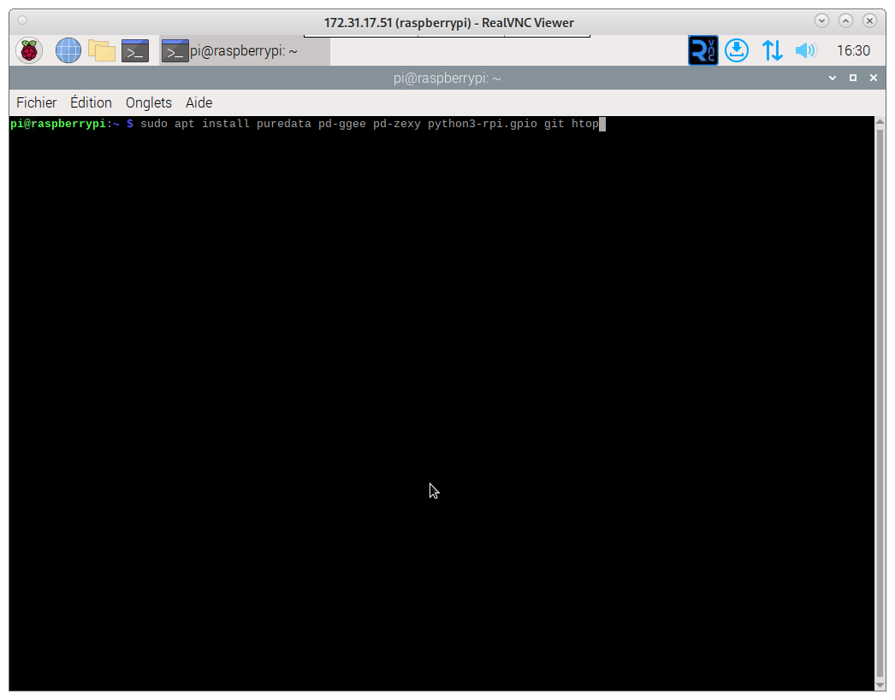
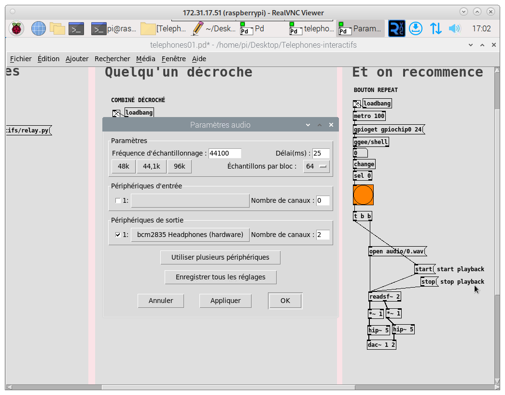
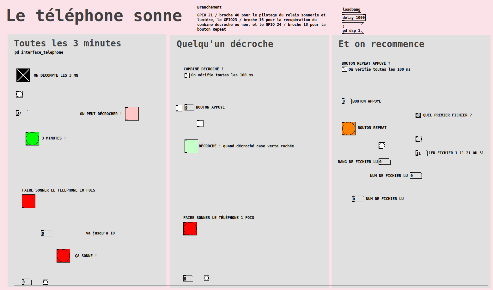

# Telephones-interactifs
## Présentation

Projet de téléphone interactif diffusant un message / un défi lorsque l'on décroche

## Installation

Fonctionne sous Raspberry Pi 3 avec [RaspeberryPi OS avec Desktop à télécharger ici](https://downloads.raspberrypi.com/raspios_armhf/images/raspios_armhf-2024-07-04/2024-07-04-raspios-bookworm-armhf.img.xz) 

Système d'exploitation à installer avec Raspberry Pi Imager [selon les instructions ici](https://www.raspberrypi.com/software/) en choisissant le mode où l'environnement graphique se charge sans avoir à se logguer 

Une fois le système installé et démarré sur la Raspberry Pi connectée à Internet, il faut lancer un terminal et taper les commandes suivantes (le mot de passe est celui de l'utilisateur créé à l'installation, par défaut l'utilisateur est Pi et le mot de passe raspberry) :
````
rm installTelephones.sh
wget https://raw.githubusercontent.com/b01xy/Telephones-interactifs/refs/heads/main/installTelephones.sh
chmod +x installTelephones.sh
./installTelephones.sh
````


En paramètres audio dans Pure Data on doit avoir Menu Media > On choisit Alsa puis dans Paramètres Audio la carte bcm2835 en sortie, on décoche l'entrée, on met 120ms en buffer/délais


L'interface graphique au final ressemble à ça :


## Mise en place des 4 séries de téléphones 
Il suffit de changer le contenu du fichier "numfichierdebut.txt" : en cliquant sur le dossier "Telephones-interactifs" sur le bureau, on peut double-cliquer sur le fichier "numfichierdebut.txt", changer le chiffre et enregistrer puis fermer (CTRL+S CTRL+Q) :
  * Sur le tél 1 et 2 on met le chiffre 1 dans le fichier 
  * Sur le tel 3 et 4 on met le chiffre 11 dans le fichier 
  * Sur le tel 5 et 6 on met le chiffre 21 dans le fichie
  * Sur le tel 7 et 8 on met le chiffre 31 dans le fichie

## Debug en local
Pour tester le relais
  python ~/Desktop/Telephones-interactifs/relay.py*
Pour tester le lancement automatique du programme
  cd ~/Desktop/Telephones-interactifs/
  ./startTelephones.sh
Pour tester le lancement automatique au démarrage
  sudo systemctl status telephone.service
  sudo systemctl restart telephone.service

## Pour debug à distance, installation de Rustdesk (en option)

````
sudo apt install libxdo3 gstreamer1.0-pipewire dpkg
wget https://github.com/rustdesk/rustdesk/releases/download/1.3.1/rustdesk-1.3.1-armv7-sciter.deb
sudo dpkg -i https://github.com/rustdesk/rustdesk/releases/download/1.3.1/rustdesk-1.3.1-armv7-sciter.deb
````
